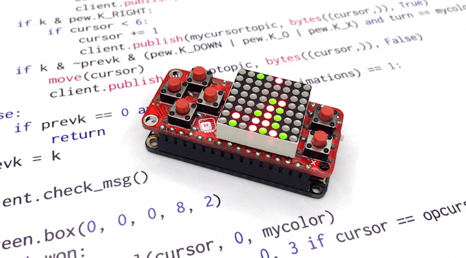

# MicroPython auf ESP8266 für Python-Anfänger

**In diesem Kurs lernst du die Programmiersprache Python kennen, indem du auf einer internetverbundenen Spielkonsole im Schlüsselanhängerformat ein Online-Spiel schreibst.**

_Der Kurs findet vorläufig online per Videokonferenz statt. Später ist geplant, ihn auch als Präsenzveranstaltung im FabLab durchzuführen._

Du hast schon Erfahrung mit Programmieren und möchtest nun die Programmiersprache Python kennenlernen? Die Allzweck-Sprache läuft auf vielen Geräten, warum nicht auf einem Mikrocontroller beginnen und damit ein hübsches Spielzeug programmieren?

Lange Zeit wurden Mikrocontroller ausschliesslich in kompilierten Sprachen wie C/C++ programmiert: das Programm wird auf dem Entwicklercomputer in Maschinensprache übersetzt (kompiliert), auf den Mikrocontroller geladen, dort neu gestartet, Fehler gesucht und im Quellcode korrigiert, und wieder von vorne los. Inzwischen sind sie leistungsfähig genug geworden, dass auch High-Level-Sprachen wie Lua, JavaScript und Python verwendet werden können. Diese sind nicht nur leichter zu lernen, sondern es kann mit ihnen auch interaktiv direkt auf dem Mikrocontroller experimentiert werden, was den Schreiben-Kompilieren-Testen-Zyklus aufbricht und die Entwicklung deutlich verschnellert.

Der ESP8266 ist ein Mikrocontroller, der vor einigen Jahren die Maker-Welt im Sturm erobert hat. Kostengünstig, leistungsfähig und mit WiFi ausgestattet, eignet er sich besonders für Internet-of-Things-Anwendungen. Dank MicroPython, einer auf die beschränkten Ressourcen von Mikrocontrollern ausgelegten Implementation von Python, kann er in Python programmiert werden.

Aus diesem Kurs nimmst du sowohl eine Allzweck-Entwicklerplatine als auch eine Mini-Spielkonsole mit nach Hause, darauf ein komplett selbst geschriebenes Online-Multiplayer-Vier-Gewinnt-Spiel. Während du unter Anleitung das Spiel programmierst, lernst du diverse der Features kennen, die Python so cool machen und von anderen Sprachen absetzen. Ausserdem lernst du das Netzwerk-Protokoll MQTT einsetzen, das für viele IoT-Projekte verwendet wird. Nach dem Kurs kannst du «pythonischen» Code schreiben, also solchen, der nicht einfach wörtlich aus einer anderen Programmiersprache übersetzt ist, sondern die Möglichkeiten der Sprache ausnützt, konzis und für andere Python-Programmierer leicht verständlich.

#### Zielgruppe und Voraussetzungen:

- Interessierte, eine neue Programmiersprache und ihren Einsatz auf einem Mikrocontroller zu lernen, ab 14 Jahren.
- Du solltest schon in einer anderen Sprache programmiert haben. Du hast auf Mac oder PC, Raspberry Pi oder Arduino, Webserver oder Browser eigene Projekte realisiert oder an Projekten mitgearbeitet. Du weisst beispielsweise, was eine Variable, eine Funktion, eine While-Schleife sind, dass es Strings (Zeichenketten) und Listen (Arrays) gibt, was Bits und Bytes sind, was die logische UND-Verknüpfung macht, wie Binärzahlen funktionieren und was der ASCII-Code ist.
- Grundlagen über Elektronik und Mikrocontroller sind nicht Teil des Kurses. Vorkenntnisse sind nicht unbedingt nötig, da wir uns hauptsächlich mit der Programmierung, nicht mit der Elektronik beschäftigen, aber hilfreich, um zu verstehen, was abläuft. Wer den Arduino-Einführungskurs besucht hat oder seinen Inhalt beherrscht, ist in dieser Hinsicht bestens gerüstet.

#### Inhaltsübersicht:

- Was ist MicroPython? Was ist der ESP8266?
- MicroPython installieren
- Netzwerk und WebREPL einrichten
- Python als Taschenrechner
- Hello World: LED blinken
- PewPew
- Vier Gewinnt Teil 1: Offline
- MQTT
- Vier Gewinnt Teil 2: Online

#### Mitbringen:

Du brauchst einen Laptop (Mac, Windows, Linux) mit WLAN und USB-A-Anschluss, auf dem du vor dem Kurs gewisse Software installieren kannst. Details dazu werden nach der Anmeldung bekanntgegeben.

_Online-Kurs:_ Zusätzlich wird eine Webcam benötigt, damit andere dein Gerät sehen können.

#### Teilnehmerzahl:

min. 3, max. 4 Personen (Online-Kurs), max. 6 Personen (Präsenzkurs)

#### Kursdauer:

- Vier Abende à 4 Stunden: zwei Mal pro Woche 18:00–22:00.
- _Präsenzkurs:_ Optionaler Vorkurs, 2 Stunden, zum Zusammenlöten der Hardware (einfache Through-Hole-Teile). Wer nicht am Vorkurs teilnimmt, erhält ein vom Kursleiter gelötetes Teil.
- _Online-Kurs:_ Kein Vorkurs, alle Teilnehmer erhalten fertig gelötete Teile per Post.

#### Kosten:

Material (Adafruit Feather HUZZAH, PewPew Lite, LiPo-Akku, USB-Kabel, Jumper-Drähte, Widerstand, LED) ~ CHF 40

_Online-Kurs:_ Postversand ~ CHF 5

43 Seiten Unterlagen

#### Workshopleitung:

Christian Walther
